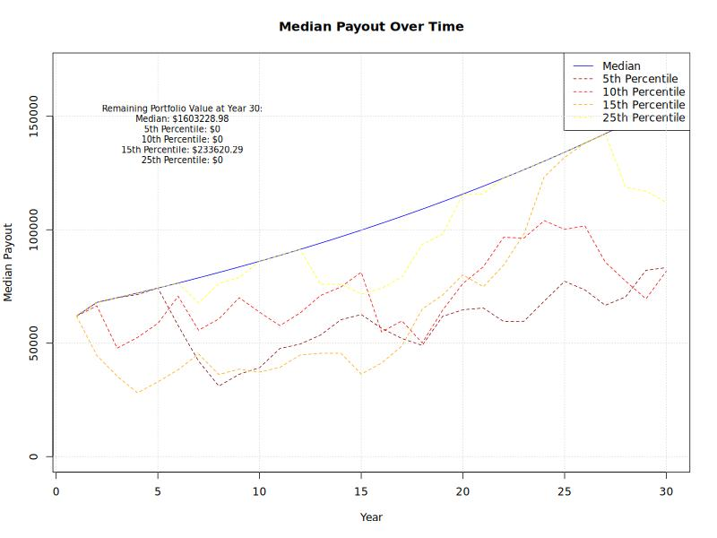

# Pension simulator for stock portfolios

This is a simple pension simulator for stock portfolios. It allows you to simulate the drawdown of a stock portfolio
over time, taking into account the expected return and volatility of the portfolio.

The strategy is to withdraw a calculated percentage of the portfolio each year, which is determined by the expected
return, similarly to how annuities work. The percentage taken out of the portfolio with `t` years remaining is
calculated as follows:

```w_t = r^(T_t-1) * (r-1) / (r^T_t - 1)```

Where:

- `w_t`: the withdrawal percentage of the portfolio for year `t`
- `r`: the expected yearly return of the portfolio (e.g., if the expected return is 5%, then `r` would be 1.05)
- `T_t`: the total number of years remaining in the drawdown period

The simulator will run multiple simulations of the portfolio's performance over the drawdown period, and it will
provide statistics on the payout amounts, the remaining portfolio value.

## Usage

To use the pension simulator, you can run the `drawdown.R` script. You can specify the parameters for the simulation,
such as the initial portfolio value, expected return, and drawdown period. For the simulation it uses historical stock
market data to model the returns of the portfolio, which is loaded from a CSV file.

```R
source("drawdown.R")
simulate_drawdown(
    initial_portfolio_value = 1000000,  # Initial portfolio value
    expected_return = 0.05,             # Expected yearly return (e.g., 5%)
    drawdown_period = 30,               # Number of years in the drawdown period
    historical_data = c(
        "data/stocks/sp500.csv",
        "data/bonds/10y_us_treasury.csv"
    ), # Path to the historical returns data file(s)
    investment_split = c(0.7, 0.3),     # Investment split between assets (e.g., 70% stocks, 30% bonds)
    max_payout = default_payout,        # Maximum payout function (e.g., $50,000 per year)
    num_simulations = 100000            # Number of simulations to run
)
```

The `max_payout` function allows you to specify a maximum payout for each year. This decreases the risk of depleting
the portfolio too quickly, resulting in low payouts in later years. For example, if you want to limit the payout to
$66,000 per year increasing with inflation, you can define the `max_payout` function as follows:

```R
default_payout <- function(year) {
  return(66000 * (1.03)^(year - 1))  # Assuming 3% inflation per year
}
```

If you do not want to limit the payout, you can simply set `max_payout` to a function that returns a negative value,
 such as:

```R
no_limit_payout <- function(year) {
  return(-1)
}
```

## Historical Data

The historical data file should contain the historical returns of the stock market. The file should have at least 30
years of data to ensure a robust simulation. The data should be in CSV format, with a column for the year and a
column for the returns. For example:

```csv
year,return
1990,0.10
1991,0.05
1992,0.08
...
```

This repository includes two sample historical data files:

- `sp500.csv` for the S&P 500 index and
- `msci_world.csv` for the MSCI World index.

You can use either of these files or provide your own historical data file.

## Output

The simulator will output statistics on the payout amounts and the remaining portfolio value at the end of the drawdown
period. You can plot the data with the following code:

```R
data <- simulate_drawdown()
plot_drawdown(data)
```

Which will generate a plot like this:


